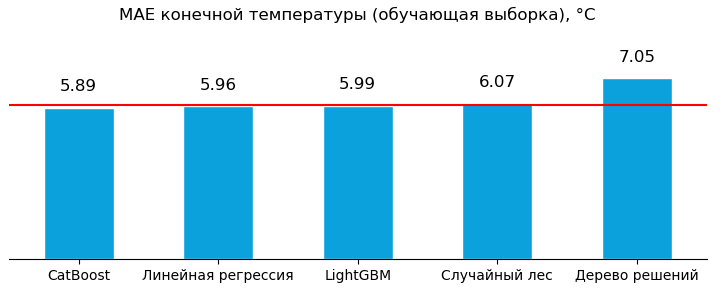
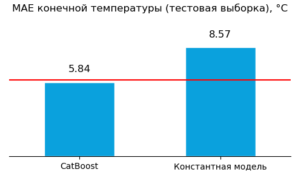

# Предсказание температуры стали

## Инструменты и библиотеки:

## Описание проекта:
**Цель проекта** — металлургическому комбинату ООО «Так закаляем сталь» нужно оптимизировать производственные расходы — уменьшить потребление электроэнергии на этапе обработки стали.

**Задача проекта** — построить модель, которая предскажет температуру стали для технологов.

<b>ОПИСАНИЕ ДАННЫХ:</b>  

Данные состоят из файлов, полученных из разных источников:

- `data_arc.csv` — данные об электродах;
- `data_bulk.csv` — данные о подаче сыпучих материалов (объём);
- `data_bulk_time.csv` *—* данные о подаче сыпучих материалов (время);
- `data_gas.csv` — данные о продувке сплава газом;
- `data_temp.csv` — результаты измерения температуры;
- `data_wire.csv` — данные о проволочных материалах (объём);
- `data_wire_time.csv` — данные о проволочных материалах (время).

 

## Отчет об итогах исследования:

### Итоги обучения и валидации моделей

Было обучено пять различных моделей с подбором наилучших параметров с помощью кросс-валидации: модель линейной регрессии, дерева решений, случайного леса, LightGBM, CatBoost.      

* Целевая метрика — среднее абсолютное отклонение (MAE) — в виду её интерпретируемости и стойкости к возможным выбросам. 
* Целевой признак — конечная температура (последняя измеренная).
* Признаки для обучения моделей:    
  * `arc_heating_net_time_sec` — чистое время нагрева (сек.),    
  *  `arc_heating_phase_duration_sec` — общая длительность фазы нагрева (сек.),    
  *  `full_power_avg` — полная мощность,    
  *  `bulk_count` — количество загрузок сыпучих материалов,    
  *  `bulk_volume` — совокупный объем подаваемых сыпучих материалов,    
  *  `bulk_load_phase_duration_sec` — общая длительность фазы загрузки сыпучих материалов (сек.),    
  *  `Bulk 1—7`, `Bulk 9—15` —  объем подачи сыпучих материалов с каждой партии-загрузки,    
  *  `gas` — продувка инертным газом,    
  *  `temp_first` — температура вначале процесса (до начала процесса),    
  *  `wire_count` — количество загрузок проволочных материалов,    
  *  `wire_volume` — совокупный объем подаваемых проволочных материалов,    
  *  `wire_load_phase_duration_sec` — длительность фазы загрузки проволочных материалов (сек.),    
  *  `Wire 1—4`, `Wire 6—9` — объем подачи проволочных материалов с каждой партии-загрузки.     

По итогу обучения и кросс-валидации три модели (CatBoost, Линейная регрессия, LightGBM) показали результат *меньше 6 градусов* среднее абсолютного отклонение конечной температуры. Лучшей моделью для дальнейшего тестирования была выбрана модель CatBoost со следующими параметрами:
  * количество итераций (iterations): 200
  * коэффициент обучения (learning_rate): 0.1

---

### Тестирование модели, общий вывод и рекомендации
    
Результатом проверки на тестовой выборке стало улучшение итоговой метрики MAE. Кроме того, целевая модель показала результаты лучше, чем константная модель, что позволяет сделать вывод о выполнении поставленной задачи исследования.    

**Таким образом, была построена модель машинного обучения на алгоритме CatBoost (с параметрами: количество итераций 200, коэффициент обучения 0.1), которая поможет предсказать температуру стали — это позволит технологам проводить эксперименты без риска для производства и оптимизировать производственные расходы металлургического комбината.**

*В качестве дальнейших шагов предлагается: проанализировать эффективность применения других моделей машинного обучения (нейронные сети, ридж/лассо регрессии, XGB и т.п.) с целью достижения лучших результатов по предсказанию температуры.*

 

