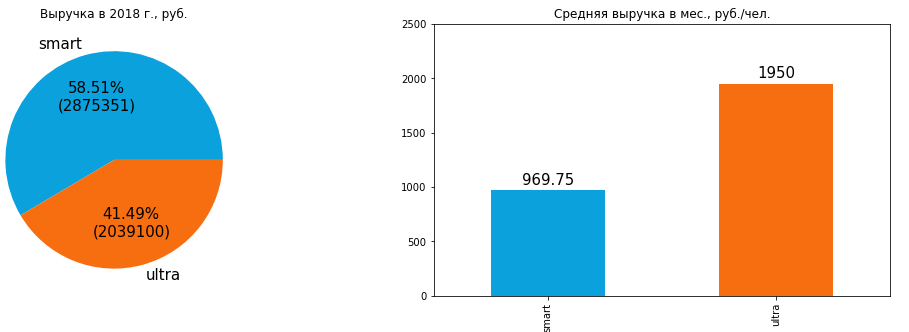

# Определение перспективного тарифа для телеком-компании

## Инструменты и библиотеки:

## Описание проекта:
Компания «Мегалайн» — федеральный оператор сотовой связи. Клиентам предлагают два тарифных плана: «Смарт» и «Ультра». 

**Цель исследования** — выявить самый прибыльный тариф для последующей корректировки рекламного бюджета.

**Задача исследования** — провести предварительный анализ тарифов на выборке из 500 клиентов  и сделать вывод — какой тариф лучше. 

**Описание тарифов:** 

Тариф «Смарт»
1.	Ежемесячная плата: 550 рублей
2.	Включено 500 минут разговора, 50 сообщений и 15 Гб интернет-трафика
3.	Стоимость услуг сверх тарифного пакета:    
   *	минута разговора: 3 рубля    
   *	сообщение: 3 рубля    
   *	1 Гб интернет-трафика: 200 рублей      

Тариф «Ультра»    
1.	Ежемесячная плата: 1950 рублей
2.	Включено 3000 минут разговора, 1000 сообщений и 30 Гб интернет-трафика
3.	Стоимость услуг сверх тарифного пакета:    
   *	минута разговора: 1 рубль    
   *	сообщение: 1 рубль    
   *	1 Гб интернет-трафика: 150 рублей 
### Описание данных:
**Описание данных таблицы `users` (информация о пользователях):**

*	`user_id` — уникальный идентификатор пользователя
*	`first_name` — имя пользователя
*	`last_name` — фамилия пользователя
*	`age` — возраст пользователя (годы)
*	`reg_date` — дата подключения тарифа (день, месяц, год)
*	`churn_date` — дата прекращения пользования тарифом (если значение пропущено, то тариф ещё действовал на момент выгрузки данных)
*	`city` — город проживания пользователя
*	`tariff` — название тарифного плана  

**Описание данных таблицы `calls` (информация о звонках):**
*	`id` — уникальный номер звонка
*	`call_date` — дата звонка
*	`duration` — длительность звонка в минутах
*	`user_id` — идентификатор пользователя, сделавшего звонок  

**Описание данных таблицы `messages` (информация о сообщениях):**
*	`id` — уникальный номер сообщения
*	`message_date` — дата сообщения
*	`user_id` — идентификатор пользователя, отправившего сообщение 

**Описание данных таблицы `internet` (информация об интернет-сессиях):**
*	`id` — уникальный номер сессии
*	`mb_used` — объём потраченного за сессию интернет-трафика (в мегабайтах)
*	`session_date` — дата интернет-сессии
*	`user_id` — идентификатор пользователя 
**Описание данных таблицы `tariffs` (информация о тарифах):**

*	`tariff_name` — название тарифа
*	`rub_monthly_fee` — ежемесячная абонентская плата в рублях
*	`minutes_included` — количество минут разговора в месяц, включённых в абонентскую плату
*	`messages_included` — количество сообщений в месяц, включённых в абонентскую плату
*	`mb_per_month_included` — объём интернет-трафика, включённого в абонентскую плату (в мегабайтах)
*	`rub_per_minute` — стоимость минуты разговора сверх тарифного пакета (например, если в тарифе 100 минут разговора в месяц, то со 101 минуты будет взиматься плата)
*	`rub_per_message` — стоимость отправки сообщения сверх тарифного пакета
*	`rub_per_gb` — стоимость дополнительного гигабайта интернет-трафика сверх тарифного пакета (1 гигабайт = 1024 мегабайта) 

## Выводы:

    

В рассматриваемой выборке доля клиентов тарифа Смарт больше, чем клиентов тарифа Ультра (70% и 30% соответственно). Соответствующим образом клиенты Смарт занимают большую долю в абсолютной выручке 2018 г. — 58.5% или 2.9 млн. руб.  Однако в удельном выражении в среднем один клиент тарифа Ультра приносит в 2 раза больше денег, чем клиент тарифа Смарт: 1950 руб./мес. против 970 руб./мес. Различия в средней выручке между пользователями тарифов Смарт и Ультра статистически значимы.

**Таким образом, исходя из критерия прибыльности,  можно заключить что тариф Ультра выглядит привлекательнее для сотового оператора, чем тариф Смарт.**

Касательно поведения клиентов в рамках тарифных планов выявлено, что интенсивность использования обоих тарифов примерно одинакова, однако большей части пользователей тарифа Смарт не хватает включенного в пакет интернета, что вынуждает их платить дополнительно сверх абонентской платы. Напротив, большинство пользователей тарифа Ультра не в полной мере используют доступные по тарифу лимиты.    
Утверждать, что средняя выручка пользователей из Москвы статистически значимо отличается от выручки пользователей из других регионов нельзя.

*Рекомендации:*
* Провести дополнительный анализ оттока клиентов тарифа Смарт и проверить гипотезу влияния повышенной переплаты клиентов на эту метрику. Возможно имеет смысл пересмотреть лимиты по данному тарифу, если переплаты негативно сказываются на удовлетворенности пользователей;
* Альтернативный вариант — создание еще одного тарифа, который будет покрывать потребности группы людей переплачивающих более 400 руб. по тарифу Смарт;
* Сделать финансовые расчеты целесообразности запуска рекламной кампании для клиентов Ультра. При одинаковой стоимости привлечения клиента ROI рекламы для клиента Смарт будет хуже. Однако, резонно предположить, что рекламная кампания для клиентов Ультра будет стоить дороже в расчете на привлеченного пользователя. Запуск рекламной кампании для клиентов тарифа Ультра имеет смысл, пока её стоимость в расчете на одного привлеченного клиента не превышает двукратной стоимости привлечения клиента тарифа Смарт. Например, если затраты на привлечение клиента Смарт составляют 100 руб., то концентрация маркетинговых усилий на привлечении клиентов Ультра эффективна, пока стоимость их привлечения остается меньше 200 руб.
